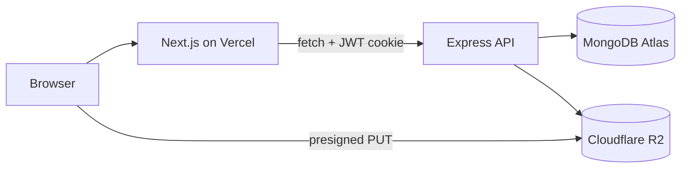

# Architecture

## Monorepo layout

```
adulis-eritrean-marketplace/
├── frontend/         Next.js 15 App Router (Vercel)
└── backend/          Express 5 + Mongoose (Hetzner VPS)
    ├── shared/       Types, Zod schemas, enums (`@adulis/shared`)
    ├── docs/         Architecture, API contract, deployment
    └── docker-compose.yml   Local MongoDB
```

## Data flow



## API layers

```
routes → controllers → services → repositories → Mongoose models
```

- **Routes** — HTTP method + path + middleware binding only
- **Controllers** — Parse validated request, call service, send JSON response
- **Services** — Business rules, authorization, cross-entity validation
- **Repositories** — Database queries; no HTTP concepts

## Frontend layers

```
app/ (routes) → features/*/components → lib/queries → lib/api → Express API
```

- **providers/** — Auth, Language, React Query, Toast
- **features/** — Domain-colocated hooks + components
- **components/** — layout/, forms/

## Shared contract

`@adulis/shared` is the single source of truth for:

- Domain types (`types.ts`)
- Zod validation schemas (`schemas.ts`)
- Enums (`enums.ts`)
- Marketplace constants (`constants.ts`)
